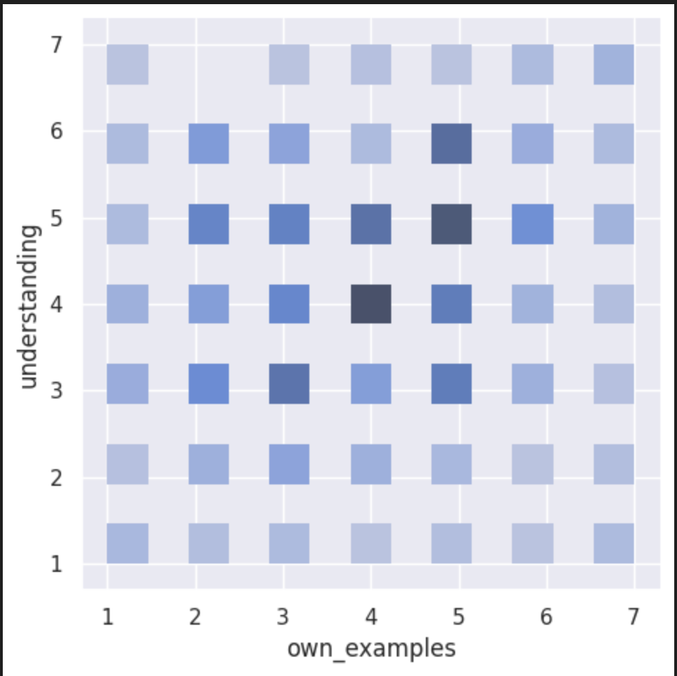

---
# Do not edit the text between these lines!
layout: default
---

# COMP110 Exercise 09 -- Rupika C & Ranjani S

<!-- This is a comment. Below, you'll see code for inserting an image. To make this image appear, update <custom-path>. To add an image, save it inside the imgs folder of this repository. -->

## small header

body text